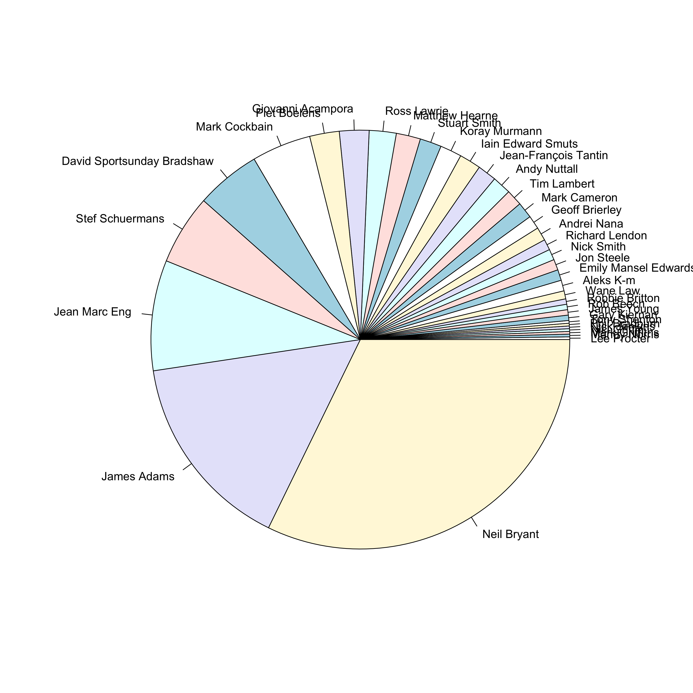

```{r setup, include=FALSE}
knitr::opts_chunk$set(echo = TRUE, message = FALSE, error = FALSE, eval = TRUE, results = "hold", fig.height = 10, fig.width = 10, dpi = 300)
options(scipen = 999)
load("URC_posts.Rdat")
library("dplyr")
```

# Note

_This blog post was originally written in 2017 for a less formal personal blog with a focus on ultramarathon running, which is a hobby that I am quite passionate about. I have decided to include all of my data science related blog posts here to keep things centralised, but please excuse the more informal language used throughout._


# Introduction

This post is a continuation from my [previous post](/post/2018-04-18-Suunto-Or-Garmin/index.html), looking at various aspects of the posting habits of the Ultra Running Community (URC). This was originally intended to be just an additional section in that blog post, but it was getting a little unwieldy so I decided to split it off into its own post to stop it from getting too crazy. This post is probably a lot less interesting than the last post, as it is really looking at one central question; can I predict which group member is posting based on the content of the message? Spoiler alert, you can't! The posters on this forum are apparently *all* sarcastic SOBs, so it is difficult to pick them apart. But it was quite interesting trying.

So as a bit of an experiment, I decided to play around with these data to see if the language that people use in their posts is specific enough to allow us to predict who has written something based on what the post says. This is a job for *machine-learning*, which is really a lot less grandiose than it sounds. Essentially what we are doing here is using data to train a model of some description that can be applied to a new set of data to make predictions. In this case, we are looking to fit a model that is able to classify posts into one of a number of groups, where each group represents a single user. As an example of a classification problem, think of the spam filter in your email client. This is essentially a model that has been trained to look at the email message content and determine whether it is spam or not (e.g. if it is full of words like *viagra*, *Nigerian Prince*, *penis enlargement*, *make money today*, etc. then it is clearly all kosher). This would be a 2-class classification problem.  

For classification problems such as this, we require a training set on which to fit our model, and a validation set to determine the quality of the model. The validation set must be independent of the training set, as we want to test how the model will generalize to new data. The idea of *cross validation* is essentially to split your training data into a training set and a validation set such that the validation is independent of the model fitting (to avoid the effects of over-fitting in the training set). There are various ways to split your data in this way. For now I will simply randomly select a subset for training and a smaller subset for validation (the *Holdout Method*), but for true cross-validation this should then be repeated several times so that the average over several validation sets is used. For example, in *k-fold cross validation* you would randomly distribute the data into ```k``` equally sized subsets, and use exactly one of these as the validation set and ```k-1``` as the training set. This is then repeated ```k``` times, each time using a different subset as the validation set. 

It makes sense to restrict this analysis to the most active posters, and so I will limit the analysis to only users who have contributed 50 or more posts to the forum. This gives us 5,233 posts, from 48 users. I will randomly select 4,000 posts for the training set, and use the remainder for validation:

``` {r 2017-04-24-predict_poster_trainset}
posts50 <- URC                 %>% 
           group_by(from_name) %>%    ## Group by poster
           filter(n() >= 50)   %>%    ## Select only posters with >50 posts
           select(from_name, message) ## Keep poster name and message content
set.seed(0) ## Set seed for random number generation for reproducibility
ids   <- sample(1:nrow(posts50), 4000) ## Randomly select 4000
train <- posts50[ids,]  ## Keep random ids as training set
test  <- posts50[-ids,] ## Use remaining ids as validation
```

# Natural Language Processing

The model that we will be using is the [Bag Of Words](https://en.wikipedia.org/wiki/Bag-of-words_model) model, which is a natural language processing technique that aims to represent text based on the frequency of words within it. There are some things that we can do to reduce the vector space of available terms, such as removing capital letters and removing so called "stop words" (common words like "is", "and", "but", "the", etc.). We can also limit the analysis to only words that occur frequently in the text, although there is a possibility of missing specific terms used by only one or two individuals, say, that may help the predictiveness of the model. 

I will be using the [text2vec](https://cran.r-project.org/web/packages/text2vec) package in R which is efficient at generating the required document-term matrix (DTM) for fitting our model. In particular, it generates unique tokens for each term rather than using the terms themselves, which reduces computational overheads. An iterative function can then be applied to generate the DTM. So let's generate such an iterator over the term tokens:

``` {r 2017-04-24-predict_poster_iterator}
library(text2vec)
train_tokens <- train$message                      %>%
                iconv("latin1", "ASCII", sub = "") %>% # Convert to ASCII format
                tolower                            %>% # Make lower case
                word_tokenizer                         # Break terms into tokens
it_train <- itoken(train_tokens, ids = train$from_name, progressbar = FALSE)
it_train
```

Next we use this iterator to create a vocabulary DTM for fitting the model. To start with, I will use all of the words, but later we could look at filtering out stop words and less frequent terms:

``` {r 2017-04-24-predict_poster_vocab}
vocab      <- create_vocabulary(it_train)
vectorizer <- vocab_vectorizer(vocab)
train_dtm  <- create_dtm(it_train, vectorizer)
dim(train_dtm)
```

The result is a matrix with 4,000 rows (the number of messages in the training set) and 13,922 columns (the number of unique terms in the training set). So each message is now represented as a vector of counts for all possible terms in the search space. The hope now is that we will be able to fit a model that is able to discriminate different users based on their word usage. Unlikely, but hey let's give it a shot. 


# Random Forest

In this case, our dependent variable is the name of the user who posted the message which is a categorical variable. The independent variables are the counts for each of the 13,922 terms across the data set. I am going to start by using a random forest model, which is one of the more popular classification models available. A decision tree is a quite simple (although incredibly powerful) stepwise model that you can think of like a flow chart. The model fitting will create a series of nodes where your independent variables are used to discrimate between one choice and another, eventually leading to a certain prediction depending on the values of the variables in your model. A random forest essentially fits a whole load of these classification decision trees and outputs the *modal* (most common) class across all of them.

One benefit of using random forests over something like generalised linear models (see later) is that, since they rely on fairly independent tests at each stage in the tree, they are more robust to correlated variables in the model. With such a large set of term variables there is undoubtedly correlation between many of these terms, particularly as many of these variables are likely to be largely made of zeroes. Of course, this sparsity itself causes somewhat of a problem, and should be taken into account in the analysis. But for now I will ignore it and just hope that it isn't a problem...

To begin with,let's fit a simple random forest model and see how it looks:

``` {r 2017-04-24-randomforest, eval = FALSE}
library("randomForest")
library("caret")
rf_model <- randomForest(x = as.matrix(train_dtm), y = as.factor(rownames(train_dtm)))
```

Note that I set the ```y``` parameter to be a factor so that it is clear that this is a classification model. Now we can test our model by seeing how it performs at predicting the user for our test data set. First we generate a similar DTM for the test data set. Note that we use the same ```vectorizer``` as we used for the training set:

``` {r 2017-04-24-predict_poster_DTM_test, eval = FALSE}
test_tokens <- test$message                       %>%
               iconv("latin1", "ASCII", sub = "") %>% # Convert to ASCII format
               tolower                            %>% # Make lower case
               word_tokenizer                         # Break terms into tokens
it_test     <- itoken(test_tokens, ids = test$from_name, progressbar = FALSE)
test_dtm    <- create_dtm(it_test, vectorizer)
```

And then we use our model to predict the user for each of the posts in our test data set. To do this we use the ```predict()``` method for ```randomForest``` objects, and output the response class with the majority vote amongst all of the decision trees:

``` {r eval = FALSE}
test_predict <- predict.train(rf_model, test_dtm, type = "response")
```

So, how did we do? Let's see how many of these were correctly predicted:

``` {r eval = FALSE}
table(test_predict == rownames(test_dtm))
```
``` {r echo = FALSE}
table(c(rep(TRUE,473), rep(FALSE,760)))
```

So this model predicts the poster only 38.4 % of the time, which isn't particularly good. 


# Model Improvements

So can we improve this? Yes, probably. The first thing that I can try is to be a little more clever in the way that I parameterise the data. So rather than simply counting words, I will instead use *n-grams* -- combinations of ```n``` words that will be more sensitive to the types of phrases that different people typically use. Obviously increasing ```n``` in this case will also increase the memory and run time considerably, so there are limits to what we can feasibly do. Also, it is probably worth noting that removal of stop words is less likely to be the best way to go about this, as this will affect the structure of the n-grams. So this time let us leave the stop words in, but parameterise with ```3-grams```. I will also limit the count to those n-grams used at least 10 times:

``` {r eval = FALSE}
vocab <- create_vocabulary(it_train, ngram = c(1L, 3L)) ## use 1-, 2- and 3-grams
vocab <- vocab %>% 
         prune_vocabulary(term_count_min = 10) ## Only keep n-grams with count greater than 10
vectorizer <- vocab_vectorizer(vocab)
dtm_train  <- create_dtm(it_train, vectorizer)
```

Note here that we used the notation ```1L, 3L```, which tells ```R``` to explicitly use integer values rather than numeric values. In many cases this has little to no effect, but in programming an integer variable will take up much less memory (4 bytes per element) than a double precision floating point number (8 bytes per element).

Another thing that we can do to improve the model fit is that we can attempt to normalise our DTM to account for the fact that different Facebook messages may be longer or shorter than others. Typically the "documents" in this case (the messages) are very small so I imagine this will have only a minimal effect. Here I will use the *term frequency-inverse document frequency* (TF-IDF) transformation. The idea here is to not only normalise the data, but also to scale the terms such that terms that are more common (i.e. those used regularly in all posts) are down-weighted, whilst those that are more specific to a small number of users (and will thus be more predictive) are up-weighted. 

``` {r eval = FALSE}
tfidf           <- TfIdf$new()
train_dtm_tfidf <- fit_transform(train_dtm, tfidf)
```

Finally there is some fine tunning that can be made to the model fitting procudure. Here we are dealing with a very sparse set of data, since most of the counts are zero in this matrix (not everybody uses every word or set of words). This can cause issues with the random forest model. In addition, there may be some imbalance in the classes (for instance as we saw above different individuals post more often than others). 

One particular aspect to explore is that different selections for the parameters can have big effects on the quality of the model. The two main parameters for a random forest are the number of trees (```ntree```) and the number of features that are evaluated at each branch in the trees (```mtry```). The higher the better for the number of trees, although run-time can be a hindrance on this. For the second parameter, I have seen it suggested that the square root of the number of features is a good place to start, and this is the default for classification anyway. So let's try increasing the number of trees, and running this on the TF-IDF transformed 3-gram data:

``` {r 2017-04-24-randomforest_tfidf, eval = FALSE}
rf_model_tfidf <- randomForest(x = as.matrix(train_dtm_tfidf), 
                               y = as.factor(rownames(train_dtm_tfidf)),
                               ntree = 1000)
```

One note to make here is that this is _slllllllloooooooooowwwwwwwwww_! This needed to be run overnight to finish. Using something like python is probably a better bet when running machine learning algorithms like this, and I will probably do another post later in the future to look at some alternative ways to do this.

So let's take a look at whether or not this model is more effective at predicting the user:

``` {r eval = FALSE}
dtm_test       <- create_dtm(it_test, vectorizer)
test_dtm_tfidf <- fit_transform(test_dtm, tfidf)
test_predict <- predict(rf_model_tfidf, as.matrix(test_dtm_tfidf), type = "response")
table(test_predict == rownames(test_dtm))
```
``` {r echo = FALSE}
table(c(rep(TRUE,482), rep(FALSE,751)))
```

Wow, so now we have improved the prediction to a whopping 39.1%. Hmm. An improvement of 0.7% was not *quite* as much as I was hoping for.


# Logistic Regression

Okay, so let's try a different model to see if that has any effect. I am going to fit a [logistic regression](https://en.wikipedia.org/wiki/Logistic_regression). Regression is simply an attempt to fit a linear approximation to a set of data that minimises the difference between the modeled value and the true value (the *residuals*). I will do a more thorough post on statistical modelling in the future, but for now think of regression models as being an attempt to fit a line of best fit between some variable $y$ that you suspect is dependent on some other variables $x_1, x_2, ..., x_n$. The idea then is to use this model to predict $y$ based on new measurements of $x_1, x_2, ..., x_n$. So here we are trying to fit a model that will provide us with an estimate of the user based on the words used in the post. 

Here I will use the [glmnet](https://cran.r-project.org/web/packages/glmnet/index.html) package to fit the logistic regression. Logistic regression is a subset of Generalised Linear Models (GLM), which are an extension of ordinary linear regression allowing for errors that are not normally distributed through the use of a link function. Since we have multiple possible classes in the dependent variable, this will be a multinomial logistic regression: 

``` {r 2017-04-24-predict_poster_regression, eval = FALSE}
library("glmnet")
glm_model_tfidf <- cv.glmnet(x = train_dtm_tfidf, y = as.factor(train$from_name), 
                              family = 'multinomial', 
                              alpha = 1,
                              type.measure = "deviance",
                              nfolds = 5,
                              thresh = 1e-3,
                              maxit = 1e3)
```

This is an n-fold cross-validated GLM (hence ```cv.glmnet```), which is a method of validation for the model that splits the data into ```n``` equally sized subsets, then uses ```n-1``` subsets as training data and the remaining subset as the validation data to test the accuracy of the model. This is repeated ```n``` times, and the average is used. This is actually a better method than I have used in these data (selecting a test data set and running the model on the remaining subset) as every sample is used in the validation, which avoids over-fitting. 

The ```family``` parameter gives the model family that defines the error model, which in turn determines the link function to be used. In this case we are using multinomial logistic regression, so the predicted response is a vector of probabilities between 0 and 1 -- one for each potential response -- all adding to 1. The link function, which defines the relationship between the linear predictor and the mean of the distribution function, is the ```logit``` function, which in the binary case gives the log odds of the prediction:

$$X\beta = ln \frac{\mu}{(1-\mu)}$$

The ```alpha``` value will utilise an L1 regularisation of the data to account for the sparsity that we see in the data. The ```type.measure``` value determines the measurement to use to determine the cross validation, in this case the misclassification error. ```nfolds``` gives the value of ```k``` for the k-fold cross validation, ```thresh``` gives the threshold for the convergence of the coordinate descent loop, and ```maxit``` gives the maximum number of iterations to perform.

So let's see if this is any better:

``` {r eval = FALSE}
test_predict <- predict(glm_model_tfidf, as.matrix(test_dtm_tfidf), type = "response")
table(colnames(test_predict)[apply(test_predict, MAR = 1, which.max)] == rownames(test_dtm))
```
``` {r echo = FALSE}
table(c(rep(TRUE,481), rep(FALSE,752)))
```

Nope. We still only see about 39% accurately assigned. 


# Discussion

Okay, so it is possible (highly probable?) that I have made some mistakes in this analysis, and that I could vastly improve the creation of the DTM, but I think it is more propbable that these posts are simply not distinct enough to determine individuals writing styles. I guess in a group with such a narrow focus, it is inevitable that people will be posting very similar content to one another. There is after all only so many ways to ask "Suunto or Garmin".

Let's examine why we are struggling to distinguish these posts in a little more detail. Below is a heatmap showing the probability for each of the 48 potential posters, predicted for all 1,233 of the posts in the validation data set. A heatmap is a kind of 3-dimensional plot, where colour is used to represent the third dimension. So the 48 potential posters are shown on the x-axis, the 1,233 posts are shown on the y-axis, and the magnitude of the estimated probability for user ```i``` based on post ```j``` is represented by a colour from red (0% probability) to white (100% probability). Note that here I have scaled the data using a square root so that smaller probabilities (which we expect to see) are more visible. The rows and columns are arranged such that more similar values are closer together. 

``` {r 2017-04-24-similar_posts, eval = FALSE}
library("gplots")
heatmap.2(sqrt(test_predict[,,1]), trace = "none", margins = c(10,0), labRow = FALSE)
```


So the biggest problem here is that the vast majority of the posts are estimated as most likely coming from either Neil Bryant, Stef Schuermans or James Adams. And actually, the ones that it gets correct are almost all from one of these posters:

```{r 2017-04-24-similar_posts_pie, eval = FALSE}
pie(sort(table(rownames(test_dtm)[colnames(test_predict)[apply(test_predict, MAR = 1, which.max)] == rownames(test_dtm)])))
```


I wonder whether these guys are skewing the model because of their, ahem, above average posting habits. But frankly at this stage I'm kind of bored, so I think that I will leave it there. Another time maybe. Ultimately I believe that these posts are simply too short and bereft of salient information to be useful for making predictions. 
