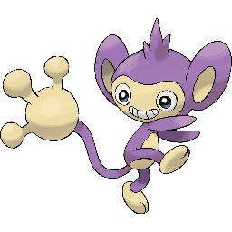
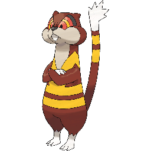

```{r setup, include=FALSE}
knitr::opts_chunk$set(echo = TRUE, message = FALSE, error = FALSE, eval = TRUE, results = "hold", fig.height = 10, fig.width = 10, dpi = 300, cache = TRUE)
options(scipen = 999)
set.seed(0)
```

# Introduction

When I saw the [Complete Pokémon Dataset on Kaggle](https://www.kaggle.com/rounakbanik/pokemon), I just had to download it and have a look! When I was younger, I was a big fan of Pokémon and used to play it regularly and watch the TV show (to this day I can recite much of the original [Pokémon Rap](https://www.youtube.com/watch?v=xMk8wuw7nek)). More recently, my daughter has become a fan, and watches the show incessently (although it beats watching Peppa Pig...). So I am going to have a look over these data and see what they can show us about these pocket monsters.

This is a fairly comprehensive analysis of the data, and will include introductions to a number of different data science techniques. I may further develop these into posts of their own in the future, so will only skim over most of them here. I hope that this post shows a fairly complete example of the types of analyses that it is possible to do with data such as these for prediction and recommendation.  


# Download data

The data about each of the Pokémon can be downloaded directly from Kaggle [here](https://www.kaggle.com/rounakbanik/pokemon/download), and I have also downloaded some images for each of the Pokémon (at least for Generations 1 to 6) from Kaggle [here](https://www.kaggle.com/kvpratama/pokemon-images-dataset/download). 

The main data are in the form of a compressed comma separated values (CSV) file. After unzipping the file, we are left with a plain text file where every row is a separate entry, and the various columns of the data set are separated by commas. So let's load the data in using the ```read.csv``` function, which will generate a ```data.frame``` object, and take a look at it:

``` {r load_data}
pokedat <- read.csv("pokemon.csv")
rownames(pokedat) <- pokedat[["name"]]
dim(pokedat)
```

So we have information for 41 variables for 801 unique Pokémon. Each Pokémon has a unique number assigned to it in the so called "Pokédex", which is common between this data set and the list of Pokémon images. This makes it easy to link the two. Back in my day, there were only 151 Pokémon to keep track of, but many years later they have added more and more with each "Generation". Pokémon Generation 8 is the most recent and has only recently been released, so we can see which generations are present in this data set by using the ```table``` function, which will show us the number of entries with each value:

``` {r gen_count}
table(pokedat[["generation"]])
```

So we can see the 151 Generation 1 Pokémon, but also additional Pokémon from up to Generation 7. We can get a fairly broad overview of the data set by using the ```str``` function to gain an overview of what is contained within each of the columns of this ```data.frame```:

``` {r str}
str(pokedat)
```

So we gave a lot of different information contained in this data set, with the vast majority being represented by numerical values. As well as the name by which we likely know them, we have the original Japanese name, as well as their fighting statistics such as ```hp``` (Health Points), ```speed```, ```attack``` and ```defense```. We also get their specific abilities, which are given in a listed format within square brackets (e.g. three abilities -- ```['Adaptability', 'Download', 'Analytic']``` -- for ```Abomasnow```). There are also various other things that we will explore now in the following sections. So let's explore these data to see how they look, and to check for any inconsistencies that need to be corrected.


# Data Cleaning

The first step in any data analysis is to check the consistency of the data to ensure that there are no missing values (and if there are, decide the best thing to do with them), to make sure that the data are consistent and fit within expected bounds, and to generally make sure that these data make sense. These are data that somebody else has generated, so it is best not to assume that they are perfect. If there are any issues, this will propogate to our downstream analyses. 


## Missing Data

First of all, let's take a look to see which of the entries for each of the columns is missing (i.e. is coded as ```NA```):

``` {r missing_data}
has_na <- apply(pokedat, MAR = 2, FUN = function(x) which(is.na(x))) 
has_na[sapply(has_na, length) > 0]
```

In general, this seems to be a fairly complete data set, with only three of the variables showing any NA data. We can see that there are 20 Pokémon with no height nor weight data:

``` {r missing_height_weight}
subset(pokedat, is.na(height_m) | is.na(weight_kg))[, c("name", "height_m", "weight_kg")]
```

Many of these are Pokémon that I know from Generation 1, and in fact seem to be sets of evolutions. For instance, Rattata evolves into Raticate:

 


Sandshrew evolves into Sandslash: 

 


And Vulpix evolves into Ninetales:

 


There are also a couple of other none-Generation 1 Pokémon, including Lycanroc which is one of my daughter's favourited from Pokémon Sun and Moon:


However, there is no obvious reason why values are missing. There are methods that can be used to account for missing data. One possible approach is to *impute* the data -- that is, we use the rest of the data to give us a rough idea of what we should see for these missing values. An example of this is to simply use the mean of the non-missing values for the missing variable. However, in this case, we can actually find these missing values by visiting an online [Pokedex](https://pokemondb.net/pokedex), so let's correct these, ensuring that we match the units for weight (kg) and height (m):

``` {r add_missing_stats}
missing_height <- list(Rattata   = c(height_m = 0.3, weight_kg =   3.5), 
                       Raticate  = c(height_m = 0.7, weight_kg =  18.5),
                       Raichu    = c(height_m = 0.8, weight_kg =  30.0),
                       Sandshrew = c(height_m = 0.6, weight_kg =  12.0),
                       Sandslash = c(height_m = 1.0, weight_kg =  29.5),
                       Vulpix    = c(height_m = 0.6, weight_kg =   9.9),
                       Ninetales = c(height_m = 1.1, weight_kg =  19.9),
                       Diglett   = c(height_m = 0.2, weight_kg =   0.8),
                       Dugtrio   = c(height_m = 0.7, weight_kg =  33.3),
                       Meowth    = c(height_m = 0.4, weight_kg =   4.2),
                       Persian   = c(height_m = 1.0, weight_kg =  32.0),
                       Geodude   = c(height_m = 0.4, weight_kg =  20.0),
                       Graveler  = c(height_m = 0.3, weight_kg = 105.0),
                       Golem     = c(height_m = 1.4, weight_kg = 300.0),
                       Grimer    = c(height_m = 0.9, weight_kg =  30.0),
                       Muk       = c(height_m = 1.2, weight_kg =  30.0),
                       Exeggutor = c(height_m = 2.0, weight_kg = 120.0),
                       Marowak   = c(height_m = 1.0, weight_kg =  45.0),
                       Hoopa     = c(height_m = 0.5, weight_kg =   9.0),
                       Lycanroc  = c(height_m = 0.8, weight_kg =  25.0))
missing_height <- t(rbind.data.frame(missing_height))
pokedat[match(rownames(missing_height), pokedat[["name"]]), c("height_m", "weight_kg")] <- missing_height
```

There are also 98 Pokémon with a missing ```percentage_male``` value. This value gives the proportion of the Pokémon out in the world that you might come across in the game that are male as a percentage. These seem to be spread throughout the entire list of Pokémon across all Generations, with no clear reason as to why they have missing values:

``` {r missing_percentgae_male}
head(subset(pokedat, is.na(percentage_male)))
```

However, by looking at a few of these in the Pokedex, it would appear that these are generally genderless Pokémon, which would explain the missing values. A sensible value to use in these cases would therefore be 0.5, representing an equal spit of male and female:

```{r}
pokedat[is.na(pokedat[["percentage_male"]]), "percentage_male"] <- 0.5
```

It is also worth noting that there are also missing values for the type2 Pokémon. These were not picked up as NA values, because they are encoded as a blank entry "". We can convert this to a more descriptive factor such as "none":

``` {r}
levels(pokedat[["type2"]])[levels(pokedat[["type2"]]) == "none"] <- "none"
```


## Numeric Range

The vast majority of these variables are numeric in nature, so it is worth checking the range of these values to ensure that they are within typical ranges that we might expect. For instance, we would not expect negative values, zero values, or values greater than some sensible limit for things like height, weight, etc. So let's take an overall look at these data ranges by using the ```summary()``` function:

``` {r summary}
summary(pokedat)
```

We can learn a few things from this. For instance, if we look at the character type variables, "Levitate" is the most common ability (although note that this is only counting the cases where there is only a single ability -- more on this later), "Dragon Pokémon" are the most common classfication [sic] (although the majority of the Pokémon are given a unique classification, which seems to go against the idea of classification), and "water" and "normal" type Pokémon are very common, and many Pokémon have flying as their secondary type. If we look at the numeric type variables, we can see that the ```against_``` values appear to be numeric values between 0 and 4 in multiples of 0.25 (they represent the Pokémon's strength against particular Pokémon types during battle), attack, defense and speed vary between 5 and 185, 230 and 180 respectively (so there is quite a big range depending on which Pokémon you have in a fight), there is at least one Pokémon that starts with a base happiness score of 0 (in fact there are 36, which is quite sad!), the percentage of males varies between 0 and 100 with 98 missing values (as expected). But overall there do not appear to be any strange outliers in these data. There are some pretty big Pokémon, but we will explore this in a little more detail later. 


## Change Variable Class

The m ajority of these data have been classified correctly by the ```read.data()``` function as either numeric or characters (which are factorised automaticallyfor use in model and potting functions later). However, there are some changes that we may wish to make. Firstly, the  ```generation``` and ```is_legendary``` variables should not be considered numeric, even though they are represented by numbers. For instance, a Pokémon could not come from Generation 2.345. So let's make these changes from numeric to factorised character variables. Note that there is a natural order to the ```generation``` values, so I will ensure that these are factorised as ordinal, just in case this comes into play later:

``` {r numeric_to_factor}
pokedat[["generation"]] <- factor(as.character(pokedat[["generation"]]), order = TRUE)
pokedat[["is_legendary"]] <- factor(as.character(pokedat[["is_legendary"]]))
```

These variabbles have been classified as factors even though they are represented by numeric values. The values representing the factor levels can actually be anything we choose, so it may be useful to change these to something more descriptive. For instance, it may be worth adding the word "Generation" to the ```generation``` variable, whilst the ```is_legendary``` variable may be more useful as a binary TRUE/FALSE value. It doesn't matter what we put, since for later analyses dummy numeric variables will be used for calculations:

``` {r relevel}
levels(pokedat[["generation"]]) <- paste("Generation", levels(pokedat[["generation"]]))
levels(pokedat[["is_legendary"]]) <- c(FALSE, TRUE)
```

The defaults for the other factors seem to be suitable, so I will leave thse as they are.

In comparison, the ```capture_rate``` value is being classed as a factor, even though it should be a number. Why is this? 

``` {r}
levels(pokedat[["capture_rate"]])
```

Aha. So there is a non-numeric value in there -- ```30 (Meteorite)255 (Core)```. Let's see which Pokémon this applies to:

```{r}
as.character(subset(pokedat, capture_rate == "30 (Meteorite)255 (Core)")[["name"]])
```

This is a "Meteor" type Pokémon that appears to have a different capture rate under different conditions. Baased on the online [Pokedex](https://pokemondb.net/pokedex), the canonical value to use here is 30 for its Meteorite form, so let's use this and convert it into a numeric value. One thing to bear in mind here is that factors can be a little funny. When I convert to a number, it will convert the level values to a number, not necessarily the values themselves. So in this case, it will not give me the values but instead will give me the order of the values. For instance. look at the output of the following example:

``` {r}
t <- factor(c("1", "2", "3", "20"))
data.frame(factor = t, level = levels(t), number = as.numeric(t))
```

So the levels are based on a character sort rather than a numeric sort, which puts "20" ahead of "4". Then, to add to this further, the factor "20" is actually  the 3<sup>rd</sup> factor so gets the value 3, whilst the factor "3" is the 4<sup>th</sup> level, and so gets a value 4. So the output is definitely not what we would expect when converting this to a number. To avoid this, we need to convert to a character value before we do anything else:

``` {r factor_to_numeric}
pokedat[["capture_rate"]] <- as.character(pokedat[["capture_rate"]])
pokedat[pokedat[["name"]] == "Minior", "capture_rate"] = "30"
pokedat[["capture_rate"]] <- as.numeric(pokedat[["capture_rate"]])
```

This should now be a pretty clean data set ready for analysis.


# Exploratory Analyses

There are a lot of data here, and I could spend ages exploring every facet, but I just really wanrt to get a tester for these data here. First of all, let's take a look at the distribution of some of the main statistics to see how they look across the dataset. For the majority of these plots, I will be using the ```ggplot2``` library which offers a very nice way to produce publication-quality figures using a standardised lexicon, along with the ```dplyr``` package which provides a simple way to rearrange data into suitable formats for producing plots. These are part of the [Tidyverse](https://www.tidyverse.org) suite of packages from Hadley Wickham, and form a very useful suite of packages with a common grammar that can be used together to make Data Science more efficient and to produce beautiful plots easily. Handy *cheat sheets* can be found for [dplyr](https://rstudio.com/wp-content/uploads/2015/02/data-wrangling-cheatsheet.pdf) and [ggplot2](https://www.rstudio.com/wp-content/uploads/2015/03/ggplot2-cheatsheet.pdf):

``` {r load_libraries}
library("ggplot2")
library("dplyr")
library("ggrepel")
library("RColorBrewer")
```


## Attack

First of all, let's take a look at the attack strength of all Pokémon split by their main type:

``` {r attack_dist, width = 12}
pokedat %>% mutate('MainType' = type1) %>%
ggplot(aes(x = attack, fill = MainType)) + 
  geom_density(alpha = 0.2) + 
  xlab("Attack Strength") + ylab("Density") +
  theme_bw() + 
  theme(axis.title   = element_text(size = 24, face = "bold"),
        axis.text    = element_text(size = 18),
        legend.title = element_text(size = 24, face = "bold"),
        legend.text  = element_text(size = 20))
```

In general, there is a wide range of attack strengths and they are largely distributed with a roughly normal distribution around the mean attack strength of 77.86 that we saw earlier. However, we do see that there are some differences in the different Pokémon types available. However, this probably isn't the easiest way to see differences between the groups. Instead, let's use a boxplot. Here, we can see the overall distribution, with the 25<sup>th</sup> percentile, the median (50<sup>th</sup> percentile), and the 75<sup>th</sup> percentile making up the range of the box, and outliers (I believe those with values in the bottom 2.5<sup>th</sup> percentile or upper 97.5<sup>th</sup> percentile) highlighted as points on the plot. I have added notches to the boxplots, which show the confidence interval represeneted by:

$$median \pm \frac{1.58*IQR}{\sqrt{n}}$$
Where IQR is the interquartile range. Essentially, if the notch values do not overlap between two boxes, it suggests that there may be a statistically significant difference between them:

``` {r attack_box, width = 12}
pokedat %>% mutate('MainType' = type1) %>%
ggplot(aes(y = attack, x = MainType, fill = MainType)) + 
  geom_boxplot(notch = TRUE) + 
  xlab("Attack Strength") + ylab("Density") +
  theme_bw() + 
  theme(axis.title   = element_text(size = 24, face = "bold"),
        axis.text.x  = element_text(size = 18, angle = 90, hjust = 1),
	axis.text.y  = element_text(size = 18),
        legend.title = element_text(size = 24, face = "bold"),
        legend.text  = element_text(size = 20))
```

From this plot, we can see that 'dragon', 'fighting', 'ground', 'rock' and 'steel' type Pokémon have higher attack strength, whilst 'fairy' and 'psychic' type seem to have slightly lower attack strength. This would make sense based on the names, and we can test this a little more formally by using an ANOVA (analysis of variance) analysis to look for significant effects of the Pokémon type on the attack strength. This can be done quite simply by using linear models:

```{r attack_vs_type1}
attack_vs_type1 <- lm(attack ~ type1, data = pokedat)
summary(attack_vs_type1)
```

It is not a great model by any means, as the R-squared values suggest that Pokémon type alone explains only a small proportion of the variance in the data. From the summary of the model, we can see that the fit model has an intercept of 70.1 (which is close to the overall mean of `r signif(mean(pokedat[["attack"]]), 4)`), with an offset specific to each of the different types. As we saw from the boxplot, 'dragon', 'fighting', 'ground', 'rock' and 'steel' all have significant increases in attack (as can be seen by the resulting p-value), but also 'dark' and 'fire' type which I missed from looking at the boxplot. We see also that 'fairy' and 'psychic' type Pokémon show a decrease in attack strength, however this difference is not significant. So if you want a strong Pokémon, then these types are your best shot:

* dark
* dragon
* fighting
* fire
* ground
* rock
* steel

It is also worth mentioning that there are a few outliers here, which represent ridiculously powerful Pokémon. In general, these are those with a strength greater than 150, but there are also two fairy Pokémon with higher strength than is typically seen within the 'fairy' type Pokémon. Let's use the [Cook's Distance](https://en.wikipedia.org/wiki/Cook%27s_distance)  to identify the outliers from the above model. The idea here is to test the influence of each Pokémon by comparing the least-squares regression with and without the sample included. A higher value indicates a possible outlier. So let's have a look at the outliers, which we are going to class as those with a Cook's Distance greater than 4 times the mean of the Cook's Distance over the entire data set (note that this is a commonly used threshold, but is entirely arbitrary):

``` {r strength_cooks}
library("ggrepel")
library("RColorBrewer")
cookdist <- cooks.distance(attack_vs_type1)
cookdist_lim <- 4*mean(cookdist, na.rm=T)#0.012
data.frame(Pokenum   = pokedat[["pokedex_number"]], 
           Pokename  = pokedat[["name"]], 
           CooksDist = cookdist,
           Pokelab   = ifelse(cookdist > cookdist_lim, as.character(pokedat[["name"]]), ""),
           Outlier   = ifelse(cookdist > cookdist_lim, TRUE, FALSE),
           PokeCol   = ifelse(cookdist > cookdist_lim, as.character(pokedat[["type1"]]), "")) %>%
  ggplot(aes(x = Pokenum, y = CooksDist, color = PokeCol, shape = Outlier, size = Outlier, label = Pokelab)) +
  geom_point() + 
  scale_shape_manual(values = c(16, 8)) +
  scale_size_manual(values = c(2, 5)) +
  scale_color_manual(values = c("black", colorRampPalette(brewer.pal(9, "Set1"))(length(table(pokedat[["type1"]]))))) +
  geom_text_repel(nudge_x = 0.2, size = 8) +
  geom_hline(yintercept = cookdist_lim, linetype = "dashed", color = "red") +
  xlab("Pokedex Number") + ylab("Cook's Distance") +
  theme_bw() +
  theme(#legend.position = "name",
        axis.title      = element_text(size = 24, face = "bold"),
        axis.text       = element_text(size = 18),
        legend.title    = element_text(size = 24, face = "bold"),
        legend.text     = element_text(size = 20),
        )
```

The flying Pokémon Tornadus and Noibat are the biggest outliers. However, interestingly whilst Tornadus has a particularly high attack strength of 100 for a flying type Pokémon, Noibat has a low attack strength of 30. So both are outliers compared to the flyiong type Pokémon as a whole, with a mean of `r mean(subset(pokedat, type1 == "flying")[["attack"]])` ± `r sd(subset(pokedat, type1 == "flying")[["attack"]])`. It is worth mentioning that Tornadus is a Legendary Pokémon which probably explains why it has a higher attack strength.


Whilst these two do not show up on the barplots, it is likely that these are responsible for the strange distribution of the notched boxplot. I suspect this odd shape is a result of the calculation of the confidence interval for the notches exceeding the 25<sup>th</sup> and 75<sup>th</sup> percentiles due to a wide range of values, but I do enjoy the fact that it looks like it is itself flying!

The two outlying fairy type Pokémon are Xerneas and Togepi, another favourite of my daughter's:


## Defence

Let's repeat this to look at the defence values across the different Pokémon types:

``` {r defence_dist, width = 12}
pokedat %>% mutate('MainType' = type1) %>%
ggplot(aes(x = defense, fill = MainType)) + 
  geom_density(alpha = 0.2) + 
  xlab("Defence Strength") + ylab("Density") +
  theme_bw() + 
  theme(axis.title   = element_text(size = 24, face = "bold"),
        axis.text    = element_text(size = 18),
        legend.title = element_text(size = 24, face = "bold"),
        legend.text  = element_text(size = 20))
```

There seems to be a bit more of a distinction between the different types as compared to the attack distribution, so let's also look at the boxplots:

``` {r defence_box, width = 12}
pokedat %>% mutate('MainType' = type1) %>%
ggplot(aes(y = defense, x = MainType, fill = MainType)) + 
  geom_boxplot(notch = TRUE) + 
  xlab("Defence Strength") + ylab("Density") +
  theme_bw() + 
  theme(axis.title   = element_text(size = 24, face = "bold"),
        axis.text.x  = element_text(size = 18, angle = 90, hjust = 1),
	axis.text.y  = element_text(size = 18),
        legend.title = element_text(size = 24, face = "bold"),
        legend.text  = element_text(size = 20))
```

We see more outliers here as compared to the attack strength and a very clear increase in defence for steel and rock type Pokémon (unsurprisingly), as well as dragon type. There are no clear types with lower defence, similar again to what we saw in the attack strength distribution plots. Let's once again look at this using linear models:


```{r defence_vs_type1}
defence_vs_type1 <- lm(defense ~ type1, data = pokedat)
summary(defence_vs_type1)
```

As expected, we see very clear significant increase in defence strength for rock and steel type Pokémon, with a slight increase seen also for dragon and ground type Pokémon. There is also a slight reduction for normal type Pokémon. Flying Pokémon again show an odd distribution, so I expect again to see outliers for this class. Let's look at the outliers now, again using the COok's Distance:

``` {r defence_cooks}
cookdist <- cooks.distance(defence_vs_type1)
cookdist_lim <- 4*mean(cookdist, na.rm=T)#0.012
data.frame(Pokenum   = pokedat[["pokedex_number"]], 
           Pokename  = pokedat[["name"]], 
           CooksDist = cookdist,
           Pokelab   = ifelse(cookdist > cookdist_lim, as.character(pokedat[["name"]]), ""),
           Outlier   = ifelse(cookdist > cookdist_lim, TRUE, FALSE),
           PokeCol   = ifelse(cookdist > cookdist_lim, as.character(pokedat[["type1"]]), "")) %>%
  ggplot(aes(x = Pokenum, y = CooksDist, color = PokeCol, shape = Outlier, size = Outlier, label = Pokelab)) +
  geom_point() + 
  scale_shape_manual(values = c(16, 8)) +
  scale_size_manual(values = c(2, 5)) +
  scale_color_manual(values = c("black", colorRampPalette(brewer.pal(9, "Set1"))(length(table(pokedat[["type1"]]))))) +
  geom_text_repel(nudge_x = 0.2, size = 8) +
  geom_hline(yintercept = cookdist_lim, linetype = "dashed", color = "red") +
  xlab("Pokedex Number") + ylab("Cook's Distance") +
  theme_bw() +
  theme(axis.title      = element_text(size = 24, face = "bold"),
        axis.text       = element_text(size = 18),
        legend.title    = element_text(size = 24, face = "bold"),
        legend.text     = element_text(size = 20),
        )
```

As expected, Noibat and Tornadus are outliers here, and are joined by Noivern (which is an evolution of Noibat). As it turns out, these are the only 3 Pokémon in the flying type, which explains why they show up as outliers and why the boxplot has such a strange distribution. Other outliers include ice-type Pokémon Avalugg (defence 184), steel-type Pokémon Steelix and Aggron (both with defence 230), and bug-type Pokémon Shuckle (defence 230) which doubles up as a rock type Pokémon:


As seen with Shuckle, we should bear in mind that we have only focussed on the primary Pokémon type here, and have not considered the ```type2``` values. So it is possible that we are missing the full picture when looking only at the first class for some of these Pokémon.

## Other

We could do this for all of the different values, and there are many different ways that we may want to examine these data. We can look at eaxch variable in the data set and examine them for odd distributions, we can look for outliers (as we have done above), we can start to examine relationships between variables, and we can look for correlation between different values (which we will do further below). Indeed a considerable amount of time *should* be spent exploring data in this way to ensure it is of good quality -- the old saying "garbage in, garbage out" is very true. But to be honest there are more interesting things that I want to do with these data, so let's crack on...


## Ensuring we use accurate data classes throughout

It is important to ensure that we are using the data in the correct way for our analyses. First of all let's take a look at the abilities that each Pokémon has. As it stands, the ```abilities``` variable is not terribly useful, as it fails to link Pokémon who may share abilities but not exactly. We could spend some time decoding the abilities, and create a "dictionary" of different abilities for each Pokémon, but perhaps a better measure may be to simply look at the *number* of abilities that each Pokémon has:

``` {r numabilities}
abilities <- strsplit(as.character(pokedat[["abilities"]]), ", ")
abilities <- sapply(abilities, FUN = function(x) gsub("\\[|\\'|\\]", "", x))
names(abilities) <- rownames(pokedat)
pokedat[["number_abilities"]] <- sapply(abilities, FUN = length)
table(pokedat[["number_abilities"]])
```

So the majority of Pokémon have only 1, 2 or 3 abilities, with only a small number of Pokémon have more than 3 abilities, and around half having exactly 3. 

I want to now look only at the variables that might theoretically be descriptive of the Pokémon in some kind of model. So we can remove the individual abilties (although the *number* of abiltities will likely be of interest), the names and Pokedex number, and the classification which seems to be fairly ambiguous. We also need to ensure that we use the dummy variables for the variables encoded as factors. 


# Normalization

Prior to doing this, I want to look at a few different ways to normalize all of the variables to ensure that they all have values that are comparable. Some algorithms are more sensitive to normalization than others, and it becomes quite obvious why this may be something to consider here when you consider that whilst the stats value ```attack``` lies between 5 and 185, the ```experience_growth``` value ranges between 600,000 and 1,640,000. That's a >10,000-fold increase. This variable will completely dominate the calculations for certain machine-learning algorithms like K-Nearest Neighbours (KNN) and Support Vector Machines (SVM) where the distance between data points is important. SO let's look at how we might want to normalize these data prior to analysis.


## Min-Max Normalization

There are a few different ways to do this. One way is to *standardize* the data, so that we bring them all into a common scale of $[0,1]$, but we maintain the distribution for each specific variable. So if one variable has a very skewed distriburtion, this will be maintained. A simple way to do this is to use the *min-max scaling* approach, where you subtract the lowest value (so that the minimum value is always zero) and then divide by the range of the data so that the data are spread in the range $[0,1]$:

$$x' = \frac{x - x_{min}}{x_{max} - x_{min}}$$

Let's compare the standardized and non-standardized attack values:

```{r standardize_attack}
attack_std <- (pokedat[["attack"]] - min(pokedat[["attack"]]))/(max(pokedat[["attack"]]) - min(pokedat[["attack"]]))
data.frame(Raw          = pokedat[["attack"]],
           Standardized = attack_std) %>%
  tidyr::gather("class", "attack", Raw, Standardized) %>%
  mutate(class = factor(class, levels = c("Raw", "Standardized"))) %>%
  ggplot(aes(x = attack, fill = class)) +
  geom_density(alpha = 0.2) +
  facet_wrap(. ~ class, scales = "free") + 
  xlab("Attack Strength") + ylab("Density") +
  theme_bw() + 
  theme(legend.position = "none",
    axis.title      = element_text(size = 24, face = "bold"),
    axis.text       = element_text(size = 18),
    legend.title    = element_text(size = 24, face = "bold"),
    legend.text     = element_text(size = 20),
    strip.text      = element_text(size = 24, face = "bold")
  )
```

So as you can see here, the distribution of the attack scores remains the same, but the scales over which the distribution is spread are different.


## Z-Score Normalization

However, sometimes it is preferable to instead that every feature has a standard distribution that can be easily described to make them more comparable. In this case, you can *normalize* the data so that the distribution of all features is shifted towards that of a [normal (Gaussian) distribution](https://en.wikipedia.org/wiki/Normal_distribution). This is a typical "bell-shaped" curve, which can be exclusively described by the mean and the standard deviation. An example where I use this approach regularly is in gene-expression analysis, where we normalize the data such that the levels of expression of each gene is represented by a normal distribution, so that we can test for samples where the expression is significantly outside of the confines of this distribution. We can then look at all of the genes that seem to show significantly different expression than we would expect using hypothesis testing approaches, and look for common functions of these genes through the use of network analysis, gene ontology analysis and other downstream analyses. 

A simple normalization approach is the z-score normalization, which will transform the data so that the distribution has a mean of 0 and a standard deviation of 1. The transformation is as follows:

$$x' = \frac{x - \mu}{\sigma}$$

So we simply subtract the mean $\mu$ (to center the data), and divide by the standard deviation $\sigma$. Let's again visualise this by comparing the raw and normalized data:

```{r normalize_attack}
attack_norm <- (pokedat[["attack"]] - mean(pokedat[["attack"]]))/sd(pokedat[["attack"]])
data.frame(Raw          = pokedat[["attack"]],
           Normalized   = attack_norm) %>%
  tidyr::gather("class", "attack", Raw, Normalized) %>%
  mutate(class = factor(class, levels = c("Raw", "Normalized"))) %>%
  ggplot(aes(x = attack, fill = class)) +
  geom_density(alpha = 0.2) +
  facet_wrap(. ~ class, scales = "free") + 
  xlab("Attack Strength") + ylab("Density") +
  theme_bw() + 
  theme(legend.position = "none",
    axis.title      = element_text(size = 24, face = "bold"),
    axis.text       = element_text(size = 18),
    legend.title    = element_text(size = 24, face = "bold"),
    legend.text     = element_text(size = 20),
    strip.text      = element_text(size = 24, face = "bold")
  )
```

So the normalized data now has a mean of 0, with the majority of values lying between -2 and 2. Note that since this is a fairly simple normalization technique, the distribution itself is not really changed, but there are other methods such as quantile normalization which can reshape the data to a Gaussian curve, or indeed any other dstribution as required.


## Choosing a Normalization Method

The choice of which method to use will largely depend on what you are trying to do. The min-max scaling method is a common method used in machine learning, but does not handle outliers very well -- a sample with an extreme value in the raw data will still have an extreme value in the scaled data, resulting in bunching up of the remaining data since it is all bounded within the range $[0,1]$. The Z-score normalization is better at dealing with outliers as they will appear far away from the mean value of 0, but the range of data is no longer bounded meaning that different variables will now have different ranges. Other normalization processes may make your data more homogenous, but at the cost of potentially losing aspects of the data that may be useful. 

Many machine learning algorithms use some kind of *distance* measure, in order to look for similarity between different items. This can be a simple Euclidean distance, which is a k-dimensional measure of "as the crow flies". If the scales are very different between your variables, then this will cause a significant issue.

For the following analyses, I will use Z-score normalization, since I know that there are a few extreme outliers in these data.


# Looking for Patterns

## Correlation of Variables

One thing that it is worth doing before heading down a route of data modelling is to look at the correlation structure between the variables in the data set. If there are highly correlated variables (for instance one might imagine height and weight to be highly correlated), then both will offer the same information to the model -- adding both will give no additional predictive power than adding only one. There is then a danger of over-fitting the data, which can happen if you create a model so complicated that, whilst it may fit the training data very well, it is so complex as to no longer be applicable to external data sets making it essentially useful. An extreme example is if we create a model where we have one variable for each sample, that is equal to 1 for that specific sample, and 0 for every other sample. This would fit the data perfectly, but would be of absolutely no use for any other data. In addition, we can risk biasing the data by including multiple variables that essentially encode the same information.

So we can calculate a pairwise correlation matrix, which will give us a measure of similarity between each pair of variables by comparing the two vectors of values for the 801 Pokémon. There are multiple measures of correlation that can be used. The standard is the [Pearson Correlation](https://en.wikipedia.org/wiki/Pearson_correlation_coefficient), which is a measure of the linearity of the relationship between two values. A value of 1 represents an entirely linear monotonic relationship (as one value increases, so does the other, but with every unit increase in one variable matching a unit increase in the other in a linear way), a value of 0 represents no linearity between the values (no clear relationship between the two), and a value of -1 represents an inverse monotonic linear relationship (anti-correlated). 

For this analysis, I will be using the [Spearman Correlation](https://en.wikipedia.org/wiki/Spearman%27s_rank_correlation_coefficient) coefficient. Instead of using the values themselves, this method first ranks the data, and then looks at the correlation. The idea here is that the unit difference between each successive value is kept constant, meaning that outliers do not have a big impact. This is therefore independent of the distribution of the data, and is therefore a non-parametric method. Since we identified some outliers with some of these variables, this method will remove the effect that these might have.

We can represent these values by using a heatmap, which is a way of representing 3-dimensional data. The value of the correlation, rather than being represented on an axis as a value, will be represented by a colour. Values of the SPearman correlation closer to 1 will appear more red, whilst those closer to -1 will appear more blue. Those closer to 0 will appear white. 

In addition, I will apply a hierarchical clustering method to ensure that the variables most similar to one another are located close to one another on the figure. Pairwise distances are calculated by looking at the [Euclidean distance](https://en.wikipedia.org/wiki/Euclidean_distance), and similar variables are clustered together, allowing us to pick out by eye those most similar to one another.

As mentioned earlier, we first want to ensure that we are looking at numerical values, or at least numerical representations of factors. 

``` {r}
pokedat_vals <- pokedat[, !names(pokedat) %in% c("abilities", "classfication", "japanese_name", "name", "pokedex_number")]
pokedat_vals[["type1"]]        <- as.numeric(pokedat_vals[["type1"]])
pokedat_vals[["type2"]]        <- as.numeric(pokedat_vals[["type2"]])
pokedat_vals[["generation"]]   <- as.numeric(pokedat_vals[["generation"]])
pokedat_vals[["is_legendary"]] <- as.numeric(pokedat_vals[["is_legendary"]])
```

This will give us a purely numeric data set for use in numeric calculations. Finally we will normalize the data using Z-score normalization:

```{r}
pokedat_norm <- scale(pokedat_vals, center = TRUE, scale = TRUE)
```

Finally let's take a look at the correlation plot:

``` {r correlation_var, height = 8, width = 14}
library("pheatmap")
pokecor_var <- cor(pokedat_norm, method = "spearman")        
colors  <- colorRampPalette(c('dark blue','white','dark red'))(255)#colorRampPalette( rev(brewer.pal(9, "Blues")) )(255)
pheatmap(pokecor_var, 
         clustering_method = "complete",
         show_colnames = FALSE,
         show_rownames = TRUE,
         col=colors, 
         fontsize_row = 24)  
```

We can see a few clear cases of correlated variables here, especially between a few of the values giving attack strength against certain Pokémon types. For instance, attack against ghost- and dark-type Pokémon are very similar (which makes sense), as are attacks against electric- and rock-type Pokémon (makes less sense). The clearest aspect of the figure is a block of high positive correlations between a number of variables associated with the Pokémon's vital statistics. So the most similar variables are those like speed, defence strength, attack strength, height, weight, health points, experience growth, etc. This makes a lot of sense, with bigger Pokémon having better attack and defence, more health points, etc. We also see that these variables are very highly anti-correlated with the capture-rate, which again makes sense -- the better Pokémon are harder to catch. However, none of these correlations seem significantly high to require the remobval of any variables prior to analysis.


## Height vs Weight

Let's take a look at the height vs the weight. We can also include a few additional variables to see how the Pokémon strength and defence affect the relationship. I am going to scale both the x-and y-axes by using a $log_{10}$ transformation to avoid much larger Pokémon drowing out the smaller ones:

``` {r height_vs_weight}
ggplot(aes(x = height_m, y = weight_kg, color = attack, size = defense), data = pokedat) +
  geom_point(alpha = 0.2) +
  scale_color_gradient2(name = "Attack", midpoint = mean(pokedat[["attack"]]), low = "blue", mid = "white", high = "red") +
  scale_size_continuous(name = "Defence", range = c(1, 10)) +
  xlab("Height (m)") + ylab("Weight (Kg)") +
  scale_x_log10() +
  scale_y_log10() +
  #theme_bw() + 
  theme(axis.title      = element_text(size = 24, face = "bold"),
        axis.text       = element_text(size = 18),
        legend.title    = element_text(size = 24, face = "bold"),
        legend.text     = element_text(size = 20),
        strip.text      = element_text(size = 24, face = "bold")
  )
```

So there is a clear relationship, and in general taller Pokémon (such as Walor, the largest of the Pokémon) also weigh more as we might expect:


We also see that in general the attack strength of the larger Pokémon is higher than the smaller ones, although there are definitely some outliers, such as Cosmeom, a legendary Pokémon only 10 cm tall that weighs nearly 1,000 kg!


## Correlation between Pokémon


``` {r correlation_pokemon, height = 9, width = 14}
pokecor_sample <- cor(t(pokedat_norm), method = "spearman")        
colors  <- colorRampPalette(c('dark blue','white','dark red'))(255)
pheatmap(pokecor_sample, 
         clustering_method = "complete",
         show_colnames = FALSE,
         show_rownames = FALSE,
         annotation = pokedat[, c("generation", "type1", "type2", "is_legendary")],
         col=colors)  
```

So here we see the correlation structure between the 801 Pokémon, and it very clearly shows similarities between groups of Pokémon. The red boxes that we see down the diagonal represent highly similar groups, and at the top I have annotated the factor variables generation, type1, type2 and is_legendary. Almost all of the legendary Pokémon cluster together, suggesting that these are all similar to one another across these variables. Similarly there are a number of Pokémon types that clearly cluster together, such as rock type and dark type Pokémon. Interestingly the Generation number seems to be unrelated to Pokémon similarity. 


## Principal Component Analysis

A good way to explore data such as these to look for underlying trends in the data is to use a dimensional-reduction algorithm to reduce these high-dimensional data down into asmaller number of easy to digest chunks. Principal component analysis (PCA) is one such approach, and can be used to look for the largest sources of variation within a high dimensional data set. For a data set with n variables, we can think of these data existing in an n-dimensional space. PCA is a mathematical trick that rotates these axes in n-dimensional space so that the x-axis of the rotation explains the largest possible amount of variation in the data, the y-axis then explains the next largest possible amount of variation, the z-axis the next largest amount, etc. In many cases, a very large amount of the total variation in the original n-dimensional data set can be captured by only a small number of so-called principal components. This can be used to look for underlying trends in the data. So let's have a look at how this looks:

``` {r PCA}
pc <- prcomp(pokedat_vals, scale. = TRUE)
pc_plot <- as.data.frame(pc[["x"]])
pc_plot <- cbind(pc_plot, pokedat[rownames(pc_plot), c("generation", "type1", "type2", "is_legendary")])
explained_variance <- 100*((pc[["sdev"]])^2 / sum(pc[["sdev"]]^2))
screeplot(pc, type = "line", main = "Principal Component Loadings")
```

In this plot, we see that PC1 and PC2 explain a lot of variance compared to the other PCs, but the drop off is not complete at this point. In a lot of data sets, the first few PCs explain the vast majority of the variance, and so this plot drops off considerably to a flat line by PC3 or PC4. Let's take a look at how discriminatory these PCs are to these data:

``` {r PCA_PC1_vs_PC2}
ggplot(aes(x = PC1, y = PC2, shape = is_legendary, color = type1), data = pc_plot) +
  geom_point(size = 5, alpha = 0.7) +
  xlab(sprintf("PC%d (%.2f%%)", 1, explained_variance[1])) +
  ylab(sprintf("PC%d (%.2f%%)", 2, explained_variance[2])) +
  theme(axis.title   = element_text(size = 14, face = "bold"),
        axis.text    = element_text(size = 12),
        legend.title = element_text(size = 18, face = "bold"),
        legend.text  = element_text(size = 14))
```

We can see that this PCA approach clearly discriminates the legendary Pokémon (triangles) from the other Pokémon (circles) in PC1, which is the new axis that explains the most variance in the data (although note that this is still only `r round(explained_variance[1],1)`%, so not a huge amount really). There is some separation seen between the different Pokémon groups, which seems to represent the second most significant source of variation, accounting for another `r round(explained_variance[2],1)`%. Let's look at PC3 as well to see if this is able to discriminate the samples further:

``` {r PCA_PC2_vs_PC3}
ggplot(aes(x = PC2, y = PC3, shape = is_legendary, color = type1), data = pc_plot) +
  geom_point(size = 5, alpha = 0.7) +
  xlab(sprintf("PC%d (%.2f%%)", 2, explained_variance[2])) +
  ylab(sprintf("PC%d (%.2f%%)", 3, explained_variance[3])) +
  theme(axis.title   = element_text(size = 14, face = "bold"),
        axis.text    = element_text(size = 12),
        legend.title = element_text(size = 18, face = "bold"),
        legend.text  = element_text(size = 14))
```

By looking at the 2^nd^ and 3^rd^ PCs, we do see a slight separation between the Pokémon types, but it is not strong. 


## Correlation-Based Recommendation

As a little aside, I want to see whether it is possible to recommend similar Pokémon to any Pokémon that you might suggest. For instance, my daughter's absolute favourite is Eevee (a cuddly fox-like Pokémon):


So let's see whether there are any other Pokémon that are similar to Eevee, based on a simple correlation match. To do this, I will calculate the Spearman correlation coefficient between Eevee and every other Pokémon, and see which the most similar are:

```{r eevee_match}
eevee <- as.numeric(pokedat_vals["Eevee", ])
eevee_cor <- apply(pokedat_vals, MAR = 1, FUN = function (x) cor(x, eevee, method = "spearman"))
head(sort(eevee_cor, decreasing = TRUE), 10)
```

So here are a few of the most similar Pokémon:




Well they all look kind of cuddly like Eevee, except for the really creepy evil beaver Patrat at the end!

However, what would be even more efficient (maybe not in this case, but in the case of a much higher-dimensional data set like a gene-expression data set of 30,000 genes) is to use the reduced dataset after using PCA. The first 10 PCs explained around two thirds of the variance on the data, so by using these 10 values rather than the 37 values originally, we reduce the computations with a relatively small loss of data. Let's see what the outputs are in this case:

```{r eevee_match_PCA}
pc_df_sub <- as.data.frame(pc[["x"]])[, 1:10]
eevee <- as.numeric(pc_df_sub["Eevee", ])
eevee_cor_pca <- apply(pc_df_sub, MAR = 1, FUN = function (x) cor(x, eevee, method = "spearman"))
head(sort(eevee_cor_pca, decreasing = TRUE), 10)
```





Similarly cute, but with another creepy one! After checking with the experiment subject (my daughter), it seems that the best hits are definitely Watchog and Furret, so this seems to cope well at picking out similarly cuddly looking Pokémon.

Obviously here we are simply looking for Pokémon with similar characteristics. This is not as in-depth as a collaboritive filtering method where we have some subjective ranking of items to help us to determine the *best* Pokémon to match somebody's needs. However, by using the reduced PCA data set we are able to find very close matches using only a reduced subset of the data. 


# Predicting Legendary Pokémon

Based on our previous analyses, we see that there is a clear discrimination between normal and Legendary Pokémon. These are incredibly rare, and very powerful Pokémon in the game. So is it possible to identify a Legendary Pokémon based on the variables available from this database? And if so, which variables are the most important?

To do predictive modelling, we need to first split our data up into a training data set to use to train the model, and then a validation data set to use to confirm the accuracy of the predictions that this model makes. There are more robust ways to do this, such as [cross-validation](https://en.wikipedia.org/wiki/Cross-validation_(statistics)) and [bootstrapping](https://en.wikipedia.org/wiki/Bootstrapping_(statistics)), which allow you to assess the accuracy of the model. Cross validation can be applied simply by using the ```caret``` package in R. 

We will also split the data randomly into two data sets -- one containing 80% of the Pokémon for training the model, and one containing 20% of the Pokémon for validation purposes. For the following model fitting approaches, we do not need to have the categorical data converted into numbers as we did for the correlation analysis, as the factors will be treated correctly automatically We do however still need to ignore the non-informative variables. In addition,  I am going to remove the "against_" columns to avoid overfitting of the data. So let's generate our two data sets:

```{r data_split}
library("caret")
set.seed(0)
split_index <- createDataPartition(y = pokedat[["is_legendary"]], p = 0.8, list = FALSE)
rm_index       <- which(names(pokedat) %in% c("abilities", "classfication", "japanese_name", "name", "pokedex_number"))
rm_index       <- c(grep("against", names(pokedat)), rm_index)
training_dat   <- pokedat[split_index,  -rm_index]
validation_dat <- pokedat[-split_index, -rm_index]
```

So let's try a few different common methods used for classification purposes.


## Support-Vector Machine

We can then train our SVM model, incorporating a preprocessing step to center and scale the data, and performing 10-fold repeated cross validation which we repeat 3 times:

``` {r}
set.seed(0)
trctrl    <- trainControl(method = "repeatedcv", number = 10, repeats = 3)
model_svm <- train(is_legendary ~., 
                   data = training_dat, 
                   method = "svmLinear",
                   trControl = trctrl,
                   preProcess = c("center", "scale"),
                   tuneLength = 10)
model_svm
```

So this model is able to predict whether the Pokémon is Legendary based on these 18 predictor variables with `r round(100*model_svm[["results"]][["Accuracy"]], 2)`% accuracy (correct predictions). The Kappa value is normalised to account for the fact that we could get pretty good accuracy if we just called everything not Legendary due to the imbalance in the classes. 

This accuracy is based on resampling of the training data. How does it cope with the validation data? Let's take a look at the confusion matrix for the predicted outcomes compared to the true values:

```{r}
predict_legendary <- predict(model_svm, newdata = validation_dat)
svm_confmat <- confusionMatrix(predict_legendary, validation_dat[["is_legendary"]])
svm_confmat
```

SO according to these multiple statistics, of the 14 Legendary Pokémon in the validation data, we correctly identified `r svm_confmat[["table"]][2,2]` of them, but missed `r svm_confmat[["table"]][1,2]`. `r svm_confmat[["table"]][2,1]` were identified incorrectly. Our ultimate accuracy is `r round(100*svm_confmat[["overall"]][["Accuracy"]],2)`%, which seems to be pretty good. However, it is possible to further tune this model, by adjusting the tuning parameter ```C```, by tweaking the parameters included in the model, and moving from a linear SVM model. However, all told, this is a pretty good result. 


## k-Nearest Neighbour

Another classification method is the k-Nearest Neighbour (kNN) algorithm. The idea here is that a record is kept of all of the data in the training data, and a new sample is compared to find the k samples "closest" to it. The classification is then calculated based on some average of the classifications of these nearest neighbours. The method of determining the "nearest" neighbour can be one of a number of different methods, including Euclidean distance as described earlier. 

Also, the value of k is very important. Using the ```caret``` package in R, we are able to test using multiple different values of k to find the value that optimises the model accuracy. So let's train our model, again performing 10-fold repeated cross validation which we repeat 3 times:

``` {r}
set.seed(0)
trctrl    <- trainControl(method = "repeatedcv", number = 10, repeats = 3)
model_knn <- train(is_legendary ~., 
                   data = training_dat, 
                   method = "knn",
                   trControl = trctrl,
                   preProcess = c("center", "scale"),
                   tuneLength = 10)
model_knn
```

We can see that the accuracy is optimised by using k = `r model_knn[["results"]][["k"]][which.max(model_knn[["results"]][["Accuracy"]])]` nearest neighbours, which gives an accuracy of `r round(100*model_knn[["results"]][["Accuracy"]][which.max(model_knn[["results"]][["Accuracy"]])], 2)`% -- below that of the SVM accuracy. Now let's test it on the validation data set:

```{r}
predict_legendary <- predict(model_knn, newdata = validation_dat)
knn_confmat <- confusionMatrix(predict_legendary, validation_dat[["is_legendary"]])
knn_confmat
```

So we can already see that the results of this model are less positive than the SVM model. 


## Logistic Regression

For classification problems with only two groups, linear regression is often a good first option. This is a generalised linear model, where we require a transformation of the response variable to ensure that it fits a continuous scale. In this case, the response variable is the probability of being in the Legendary class, so we need to map this to the simple yes/no outcome of the input training data. The logit function is often used, which is a transformation between a probability `p` and a real number:

$$logit(p) = log(\frac{p}{1-p})$$

So let's fit a logistic regression model containing all of our data, again using 3 repeats of 10-fold cross validation, and see what we get back:

``` {r warning = FALSE}
set.seed(0)
trctrl    <- trainControl(method = "repeatedcv", number = 10, repeats = 3)
model_logreg <- train(is_legendary ~., 
                      data = training_dat, 
                      method = "glm",
                      family = "binomial",
                      trControl = trctrl,
                      preProcess = c("center", "scale"),
                      tuneLength = 10)
model_logreg
```

So we actually get a better accuracy from the cross-validation than for SVM or kNN at `r round(100*model_logreg[["results"]][["Accuracy"]], 2)`% accuracy. So let's test it on the validation data set:

```{r warning = FALSE}
predict_legendary <- predict(model_logreg, newdata = validation_dat)
logreg_confmat <- confusionMatrix(predict_legendary, validation_dat[["is_legendary"]])
logreg_confmat
```

The accuracy of this model on the validation data set is `r round(100*logreg_confmat[["overall"]][["Accuracy"]],2)`%. 


## Random Forest

As a final model, we will look at using a random forest classifier. A random forest is essentially created by creating a number of decision trees and averaging over them all. I will use the same cross-validation scheme as previously, and will allow ```caret``` to identify the optimum parameters:

``` {r}
set.seed(0)
trctrl    <- trainControl(method = "repeatedcv", number = 10, repeats = 3)
model_rf <- train(is_legendary ~., 
                  data = training_dat, 
                  method = "rf",
                  trControl = trctrl,
                  preProcess = c("center", "scale"),
                  tuneLength = 10)
model_rf
```

This approach identified an accuracy of `r round(100*model_rf[["results"]][["Accuracy"]][which.max(model_rf[["results"]][["Accuracy"]])], 2)`% (with a normalised kappa value of `r round(100*model_rf[["results"]][["Kappa"]][which.max(model_rf[["results"]][["Accuracy"]])], 2)`%) with an ```mtry``` value of `r model_rf[["results"]][["mtry"]][which.max(model_rf[["results"]][["Accuracy"]])]`. This is incredibly good, and is the best outcome so far. However, it is worth noting that this approach is significantly slower than the others. Let's check against our validation data set:

```{r}
predict_legendary <- predict(model_rf, newdata = validation_dat)
confusionMatrix(predict_legendary, validation_dat[["is_legendary"]])
```

So whilst the training accuracy is nearly 100%, here we see slightly lower accuracy on the test data set. It is still pretty good going, but could still be improved.


# Conclusion

We have managed to explore these data in a number of different ways and have identified some interesting themes and patterns. However, there is a lot of additional work that can be done. Correlation-based recommendation seems to work to identify similar Pokémon, at least in the small number of cases that I looked at. My wife showed me [this](https://www.amazon.co.uk/Pokemon-Trainer/dp/B07GYQC8C7) toy that can guess any Pokémon that you think of, which probably uses a similar approach. I'm in the wrong business...

It is worth noting that here I have concentrated predominantly on the accuracy of the model, but in general this is not the only metric that we should be interested in. As mentioned previously, given how many more non-Legendary Pokémon there are, we would get a pretty good accuracy if we just assumed that none of the test samples were Legendary. Sensitivity and Specificity for instance are useful to look at, which define the proportion of samples called correctly as Legendary (True Positives) and the proportion of those called correctly as not Legendary (Truse Negatives). Often, if we think of the opposite of these, False Negatives are more of an issue than False Positives -- e.g. for disease prediction we would probably prefer not to miss any potential cases.

Also, whilst it was interesting to play with some of the most commonly used machine learning methods, I have spent no real time tuning the model parameters. The variables themselves used in the data set could be tweaked to identify those variables most associated with the response variable. Given that these are incredibly rare and powerful Pokémon, we will inevitably find that the fighting based variables like attack and defence are highly discriminative, but also those such as the capture rate and experience growth associated. In addition, we have looked only at additive models here and have not considered interaction terms. We can also spend time fine-tuning the parameters of the models themselves to improve the accuracy further. 

However, despite this, we got some very good results from the default model parameters for several commonly used methods. kNN, SVM, logistic regression and random forests gave very similar results, but with SVM and random forest giving the best predictive outcomes. 

Ultimately, the key to developing any machine learning algorithm is to trial multiple different approaches and tune the parameters for the specific data in question. Also, a machine learning algorithm is only as good as the data that it is trained on, so feeding in more good quality cleaned data will help the model to learn. Ultimately, machine learning is aimed at developing a model that is able to predict something from new data, so it needs to be as generalised as possible. 

So hopefully when I come across a new Pokémon not currently found in my Pokedex, I can easily check whether it is Legendary by asking it a few questions about its vital statistics. Very useful.

Gotta catch 'em all!


# Session Info

``` {r sessioninfo}
sessionInfo()
```
